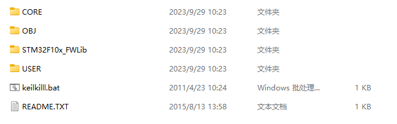
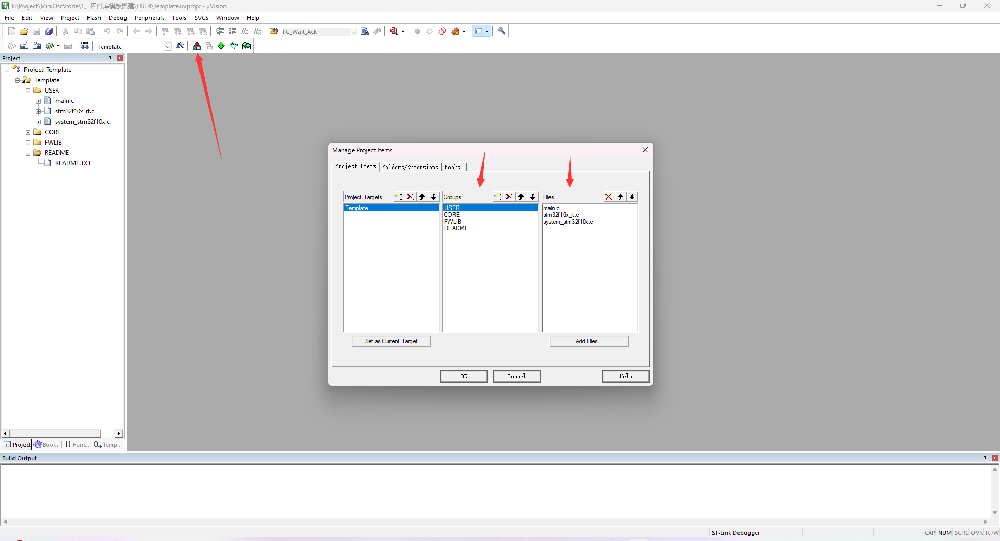
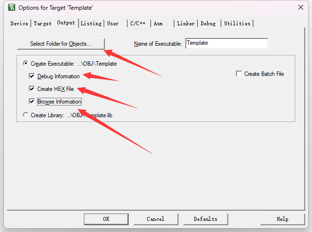
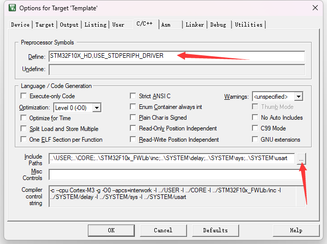

# 快速入门

## 新建文件夹

文件夹的建立不一定要一样，但是该有的内容必须都要有，我们学习正点原子的建立方式。

按照以下方式建立文件夹



先建立这些文件夹，那个keilkill.bat可以先不管，那是一个删除编译产生的文件的工具，直接复制就行，READEME.TXT是文档说明。然后往各个文件夹中放官方移植代码，必须要有以下文件。

| 文件夹             | 文件名                 | 文件功能                            |
| ------------------ | ---------------------- | ----------------------------------- |
| CORE               | core_cm3.c             | CMSIS Cortex-M3核心外围访问层源文件 |
|                    | core_cm3.h             | CMSIS Cortex-M3核心外围访问层头文件 |
|                    | startup_stm32f10x_hd.s | 启动文件                            |
| OBJ                |                        | 放置编译文件，这里不管              |
| STM32F10xFWLIB/inc | *.h                    | 放置标准库头文件                    |
| STM32F10xFWLIB/src | *.c                    | 放置标准库源文件                    |
| USER               | main.c                 | 用户程序入口                        |
|                    | stm32f10x.h            | 寄存器地址初始化，外设结构体初始化  |
|                    | stm32f10x_conf.h       | 包含外设头文件                      |
|                    | stm32f10x_it.c         | 一些中断服务函数                    |
|                    | stm32f10x_it.h         | 一些中断服务函数的头文件            |
|                    | system_stm32f10x.c     | 系统、时钟初始化                    |
|                    | system_stm32f10x.h     | 系统、时钟初始化头文件              |

有了以上这些文件我们就可以来建工程了，每个文件夹的具体文件，可以在开源项目文件夹中查看，可以先不管每个文件有什么功能，直接移植就可以。

## 新建工程

有了文件夹后，我们新建一个工程，工程建立这里就不说了，工程建立的路径放在刚刚建好的文件夹的USER文件夹中，工程建好后，我们需要配置工程内的文件夹，和相关参数。



工程建好后，可以点击上面的这个管理工程文件夹的按钮，然后就会弹出以下画面，当然也可以直接在左边Project的框框中的Template文件夹右键然后Add Group来添加文件夹，以及双击文件夹添加文件，但是最开始添加大量文件的时候，直接用这个管理器感觉比较方便，这个看自己。

管理器中间框，就是文件夹，右边框就是对应文件夹的文件，按照图中所示建立好文件，然后在点击相应的文件夹后，点击下面的Add Files。

在USER文件夹下，添加外面文件夹USER中移植的.c文件。

在CORE文件夹下，添加外面文件夹CORE中移植的.c文件和那个启动文件startup_stm32f10x_hd.s。

在FWLIB文件夹下，添加外面文件夹的 STM32F10xFWLIB中的src中的全部.c文件。

在README文件夹下，添加外面文件夹中移植的README.TXT文件。

然后工程文件模板就建立好了。

点击main.c文件，在文件中写上基础必须的文件，然后试着编译。

```c
#include "stm32f10x.h"

int main(void)
{	
	while(1)
	{

	}
}
```

如果直接编译，理论上是会报错的，我们需要进行KEIL工程的相关配置，点击上面的魔术棒。


在弹出的框中，我们进行以下配置。



在这个配置项中，第一个的选择文件夹，我们就选择我们之前在外面建立的OBJ文件夹，这样，他就会把我们编译的文件全部放到这个文件夹中，记得选着文件夹的时候一定要点到最里面去然后再确认。然后记得勾上下面这几个选项，编译要使用。



在这个选项卡中注意这两个点，第一个地方，填写以下信息，这个就是一个宏定义，他会把代码中相关定义的文件打开

```
STM32F10X_HD,USE_STDPERIPH_DRIVER
```

第二个部分，记得将所有有.h文件的路径添加进去，不然就会报错。

然后编译就不会有问题了。
