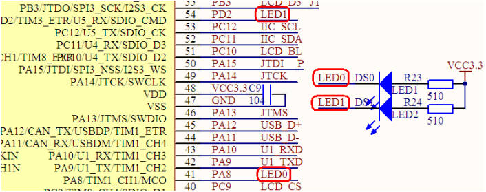
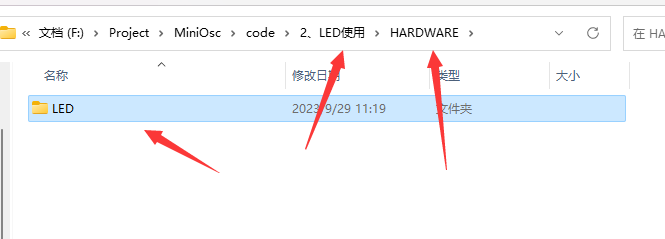

# 快速入门

## LED基础知识

LED 即发光二极管，当 LED 内有电流通过时会发光，在安全电流范围内，电流越大，亮度越亮。

我们在这个项目中拿LED做一些指示灯。比如可以做一个一直闪烁的LED灯证明程序在正常运行，也可以就是某些条件满足的时候点亮LED灯。

## Mini板LED灯电路图



可以看到，Mini板上STM32的PA8和PD2口分别连了两个LED灯，看LED灯的电路流向就是IO口输出低电平灯就亮，输出高电平灯就熄灭。

所以我们的目标就是，将这两个IO口配置成普通IO口，然后输出高低电平。

## 工程配置

我们要再在外面建立一个新的文件夹来保存硬件设备的初始化信息，我们将它命名为HARDWARE。然后再在里面建立一个LED的文件夹，用来保存LED相关代码。



在工程中，也建立一个新的文件夹HARDWARE，拿来保存硬件相关代码。然后点击软件左上角的建立新文件，建立两个文件，建立后，保存文件在刚刚建立的LED文件夹中，分别取名，bsp_led.c，bsp_led.h，然后双击工程文件夹中的HARDWARE文件夹将bsp_led.c文件放置在该文件中，同时，在魔术棒中，添加LED的.h文件夹路径。这样就配置完成。

## LED相关配置

一般，配置IO的步骤就是，打开对应IO口的时钟，然后配置IO的相关参数，然后初始化该IO口。

以下便是他的初始化

```C
void bsp_led_init(void)
{
	//打开时钟
	RCC_APB2PeriphClockCmd(RCC_APB2Periph_GPIOA,ENABLE);
	RCC_APB2PeriphClockCmd(RCC_APB2Periph_GPIOD,ENABLE);
	//初始化IO口
	{
		GPIO_InitTypeDef GPIO_InitStruct;    //定义一个IO口参数结构体
		
		GPIO_InitStruct.GPIO_Pin  = GPIO_Pin_8;         //选择想要配置的端口
		GPIO_InitStruct.GPIO_Mode = GPIO_Mode_Out_PP;   //选择想要的输出形式
		GPIO_InitStruct.GPIO_Speed= GPIO_Speed_50MHz;   //选择想要输出的速度
		
		GPIO_Init(GPIOA,&GPIO_InitStruct);   //根据参数结构体，初始化该参数
		
		GPIO_InitStruct.GPIO_Pin  = GPIO_Pin_2;        //选择想要配置的端口
		GPIO_Init(GPIOD,&GPIO_InitStruct);   //根据参数结构体，初始化该参数
	}
}
```

这样我们就初始化了两个IO口，至于为什么第二个IO口初始化的时候，只配置了引脚，而没有配置另外两个，是因为PD2另外两个的配置参数和PA8是一样的，那么我们之前定义的结构体参数，另外两个变量的参数就不会改变，所以只需要改变一个参数就可以初始化另一个IO口了。

输出形式和输出速度，入门可以就先记住这种配置方式，当理解更加深入的时候再来修改这个参数。

初始化完，就要进行IO口的高低电平输出。以下是示例，该示例将led的闪烁进行了一个封装。

```C
void led0_on()
{
	GPIO_ResetBits(GPIOA,GPIO_Pin_8);
}

void led0_off()
{
	GPIO_SetBits(GPIOA,GPIO_Pin_8);
}

void led1_on()
{
	GPIO_ResetBits(GPIOD,GPIO_Pin_2);
}

void led1_off()
{
	GPIO_SetBits(GPIOD,GPIO_Pin_2);
}
```

由函数名字就可以看出GPIO_ResetBits就是将IO口的电平拉低，GPIO_SetBits就是将IO口的电平设置低，前面我们有说，控制IO口的高低电平输出就是在控制LED的亮灭。

现在控制代码都写完了，记得我们要在.h文件中进行声明，然后才能在其他函数中使用

```c
//bsp_led.h

#ifndef _BSP_LED_H
#define _BSP_LED_H

#include "stm32f10x.h"

void bsp_led_init(void);
void led0_on(void);
void led0_off(void);
void led1_on(void);
void led1_off(void);

#endif
```

上面代码中的#ifndef #define #endif 这个是编译处理，他会检查这个文件是否编译过，让这个文件只编译一次。

我们在main函数中应用这个文件。

```c
#include "stm32f10x.h"

#include "bsp_led.h"

int main(void)
{	
	bsp_led_init();
	
	led0_off();
	led1_on();
	
	while(1)
	{

	}
}
```

然后编译下载，就可以看到LED0灭，LED1亮了。
