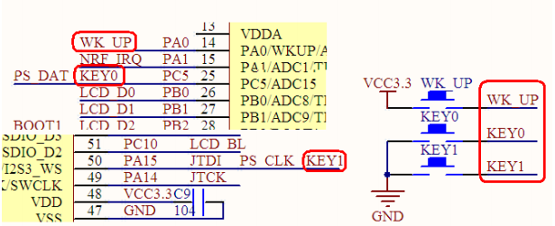

# 快速入门

## 按键原理图



由图可知，按键WK_UP连接的PA0，按键KEY0连接的按键PC5，按键KEY1连接的按键PA15，那么我们的目的，就是配置这3个引脚的输入检测。

## 工程配置

像LED一样，建立KEY文件夹放置按键相关的文件，在工程中建立bsp_key.c和bsp_key.h文件，然后添加KEY的文件夹路径。

## 按键相关配置

按键的初始化流程和led很像，因为他也只是个单纯的控制GPIO的输入。

以下是他的配置

```c
void bsp_key_init()
{
	//打开时钟
	RCC_APB2PeriphClockCmd(RCC_APB2Periph_GPIOA,ENABLE);
	RCC_APB2PeriphClockCmd(RCC_APB2Periph_GPIOC,ENABLE);
	//初始化IO口
	{
		GPIO_InitTypeDef GPIO_InitStruct;
		
		GPIO_InitStruct.GPIO_Pin  = GPIO_Pin_0;
		GPIO_InitStruct.GPIO_Mode = GPIO_Mode_IPD;
		
		GPIO_Init(GPIOA,&GPIO_InitStruct);
		
		GPIO_InitStruct.GPIO_Pin  = GPIO_Pin_5;
		GPIO_InitStruct.GPIO_Mode = GPIO_Mode_IPU;
		
		GPIO_Init(GPIOC,&GPIO_InitStruct);
		
		GPIO_InitStruct.GPIO_Pin  = GPIO_Pin_15;
		GPIO_Init(GPIOA,&GPIO_InitStruct);
	}
}
```

这个配置可以看到PA0的模式是GPIO_Mode_IPD，这是内部下拉的意思，简单理解就像内部设置低电平，然后按键按下的时候PA0不是接的3V3吗，就会把引脚拉高，看着就像没有按键输入的时候就是内部下拉的低电平，有按键按下后，就是高电平，以此来判断按键的输入，而PC5和PA15为什么设置GPIO_Mode_IPU，这是内部下拉的意思，就是内部本来将引脚拉高了，是高电平，然后，按键按下后，外面接的地，就把引脚拉低了，以此来判断按键的输入。

初始化完，就要进行引脚的检测。

```c
uint8_t get_key_wkup_value(void)
{
	return GPIO_ReadInputDataBit(GPIOA,GPIO_Pin_0);
}

uint8_t get_key_0_value(void)
{
	return GPIO_ReadInputDataBit(GPIOC,GPIO_Pin_5);
}

uint8_t get_key_1_value(void)
{
	return GPIO_ReadInputDataBit(GPIOA,GPIO_Pin_15);
}
```

看代码就可以知道，GPIO_ReadInputDataBit函数就可以读出相应引脚的电平。

在main函数中测试这个代码。

```c
#include "stm32f10x.h"

#include "bsp_led.h"
#include "bsp_key.h"


int main(void)
{	
	bsp_led_init();
	bsp_key_init();
	
	while(1)
	{
		if(get_key_wkup_value() == 0)
		{
			led1_on();
		}else
		{
			led1_off();
		}
		
		if(get_key_0_value() == 0)
		{
			led0_on();
		}else
		{
			led0_off();
		}
	}
}
```

这里是做了个简单的按键检测，然后控制LED的亮灭。

## 外部中断

先简单介绍一下中断的概念，在 STM32 中，对信号的处理可以分为轮询方式和中断方式，轮询方式就是不断去访问一个信号的端口，看看有没有信号进入，有则进行处理，中断方式则是当输入产生的时候，产生一个触发信号告诉 STM32 有输入信号进入，需要进行处理。

中断的流程就是，先初始化一个条件，这个条件可以是引脚检测到下降沿，可以是你定的一个倒计时，或者其他条件，你的程序正在顺序执行中，一旦这个条件满足了，他就会暂停当前执行的程序，去执行中断服务函数里面的程序，当中断服务函数的程序执行完了后，又返回之前正在执行的程序。

## 外部中断配置

我们这里的按键中断，他的中断条件就是引脚发生了边沿变换，就像下面

上升沿中断：当 GPIO 的电平从低电平跳变成高电平时，引发外部中断。

下降沿中断：当 GPIO 的电平从高电平跳变成低电平时，引发外部中断。

像LED一样，建立EXTI文件夹放置外部中断相关的文件，在工程中建立bsp_exti.c和bsp_exti.h文件，然后添加EXTI的文件夹路径。

按键外部中断的配置流程为 初始化引脚 ->打开复用时钟->初始化外部中断条件->初始化中断优先级

```c
void bsp_exti_init()
{
	//初始化按键
	bsp_key_init();
	//打开复用时钟
	RCC_APB2PeriphClockCmd(RCC_APB2Periph_AFIO,ENABLE);
	//中断线初始化
	{
		EXTI_InitTypeDef EXTI_InitStructure;
		
		EXTI_InitStructure.EXTI_Line    = EXTI_Line0;	           //中断线
		EXTI_InitStructure.EXTI_Mode    = EXTI_Mode_Interrupt;	   //中断模式
		EXTI_InitStructure.EXTI_Trigger = EXTI_Trigger_Rising;     //触发方式
		EXTI_InitStructure.EXTI_LineCmd = ENABLE;
		
		EXTI_Init(&EXTI_InitStructure);
		
		EXTI_InitStructure.EXTI_Line    = EXTI_Line5;
		EXTI_InitStructure.EXTI_Trigger = EXTI_Trigger_Falling;		
		EXTI_Init(&EXTI_InitStructure);
		
		EXTI_InitStructure.EXTI_Line    = EXTI_Line15;
		EXTI_Init(&EXTI_InitStructure);
		
		//初始化中断线
		GPIO_EXTILineConfig(GPIO_PortSourceGPIOA,GPIO_PinSource0); 
		GPIO_EXTILineConfig(GPIO_PortSourceGPIOC,GPIO_PinSource5);
		GPIO_EXTILineConfig(GPIO_PortSourceGPIOA,GPIO_PinSource15);
	}
	//NVIC初始化
	{
		NVIC_InitTypeDef NVIC_InitStructure;
		
		NVIC_InitStructure.NVIC_IRQChannel = EXTI0_IRQn;			//使能外部中断通道
		NVIC_InitStructure.NVIC_IRQChannelPreemptionPriority = 2;	//抢占优先级 
		NVIC_InitStructure.NVIC_IRQChannelSubPriority =        0;	//子优先级
		NVIC_InitStructure.NVIC_IRQChannelCmd = ENABLE;				//使能外部中断通道
		
		NVIC_Init(&NVIC_InitStructure); 
		
		NVIC_InitStructure.NVIC_IRQChannel = EXTI9_5_IRQn;			//使能外部中断通道
		NVIC_InitStructure.NVIC_IRQChannelPreemptionPriority = 2;	//抢占优先级
		NVIC_InitStructure.NVIC_IRQChannelSubPriority =        1;	//子优先级
		NVIC_InitStructure.NVIC_IRQChannelCmd = ENABLE;				//使能外部中断通道
		
		NVIC_Init(&NVIC_InitStructure); 
		
		NVIC_InitStructure.NVIC_IRQChannel = EXTI15_10_IRQn;			//使能外部中断通道
		NVIC_InitStructure.NVIC_IRQChannelPreemptionPriority = 2;	//抢占优先级 
		NVIC_InitStructure.NVIC_IRQChannelSubPriority =        2;	//子优先级
		NVIC_InitStructure.NVIC_IRQChannelCmd = ENABLE;				//使能外部中断通道
		
		NVIC_Init(&NVIC_InitStructure); 
	}
}
```

中断线初始化中，初始化了这个中断触发的条件，比如按键WK_UP，他是PA0，对应的中断线就是0,然后因为他按下按键是由低到高，所以就是上升沿触发中断EXTI_Trigger_Rising，最后，再使用GPIO_EXTILineConfig函数将对应的引脚，和中断线对起来，一根线只能有一个中断源，EXTI_Line0只能和PA0,PB0,PC0,PD0等0号引脚相连，当他和PA0相映射后，就不能和PB0相映射了，其他的引脚同理。

NVIC初始化，是在初始化这个中断的优先级，当两个条件同时满足的时候，中断优先级高的执行，关于中断通道EXTI0~4有自己独立的，5~9共用一个，10~15共用一个，优先级先比较抢占优先级，再比较子优先级，数字越小优先级越高，关于等级大小有5种分配，如下

| 配置方式             | 抢占优先级 | 子优先级 |
| -------------------- | :--------: | -------- |
| NVIC_PriorityGroup_0 |     0      | 0~15     |
| NVIC_PriorityGroup_1 |    0~1     | 0~7      |
| NVIC_PriorityGroup_2 |    0~3     | 0~3      |
| NVIC_PriorityGroup_3 |    0~7     | 0~1      |
| NVIC_PriorityGroup_4 |    0~15    | 0        |

这个分配，一般在main函数最前方，通过NVIC_PriorityGroupConfig函数初始化。

中断初始化配置完成后，就要写中断服务函数了，中断服务函数，可以写在工程任何位置，但是该函数各个中断通道都各自只能有一个，而且函数名固定。

```c
void EXTI0_IRQHandler(void)
{
	if(EXTI_GetITStatus(EXTI_Line0) == SET)
	{
		led0_off();
	}
	EXTI_ClearITPendingBit(EXTI_Line0); 
}

void EXTI9_5_IRQHandler(void)
{
	if(EXTI_GetITStatus(EXTI_Line5) == SET)
	{
		led0_on();
	}
	EXTI_ClearITPendingBit(EXTI_Line5); 
}

void EXTI15_10_IRQHandler(void)
{
	if(EXTI_GetITStatus(EXTI_Line15) == SET)
	{
		
	}
	EXTI_ClearITPendingBit(EXTI_Line15); 
}
```

当对应通道的中断源触发的时候，就会进入对应的通道服务函数，记得在退出中断服务函数的时候要清除中断标志位，不清除就可能一直进入中断。
