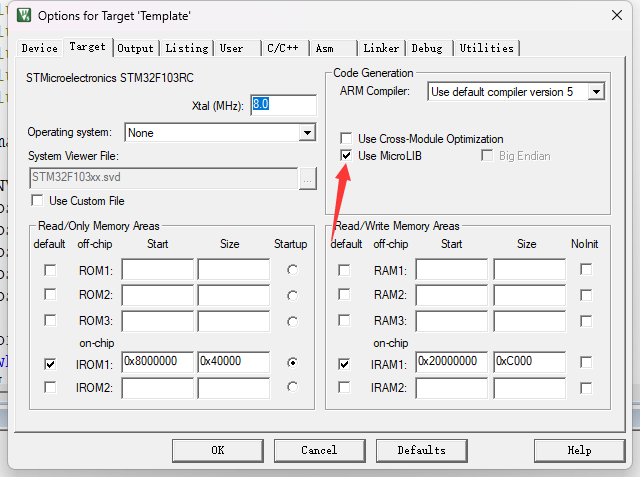

# 快速入门

## 串口基础

串口是一种全双工的通信方式，意思就是可以在发的时候也接收，两台设备连接，己方设备TX连接对方设备RX，己方设备RX连接对方设备TX，然后只要配置的参数一样就可以通信了，常规的通信是1个字节8位的传输。

单片机一般会有几个串口，比如，F103ZET6就有5个串口。

## Mini板串口硬件

串口是TTL电平，想要和电脑通信，就要用转换电平的芯片，常用USB转TTL，常用芯片为CH340，Mini板上的串口连接了CH340的是串口1，发送用的PA9，接受用的PA10，所以直接将该USB连接到电脑就可以通信。

## 串口工程配置

先是初始化配置，开时钟->初始化引脚->初始化串口->初始化中断

```c
void bsp_usart1_init(uint32_t bound)
{
	//打开时钟
	RCC_APB2PeriphClockCmd(RCC_APB2Periph_USART1, ENABLE);
	RCC_APB2PeriphClockCmd(RCC_APB2Periph_GPIOA, ENABLE);
	//引脚初始化
	{
		GPIO_InitTypeDef GPIO_InitStructure;
		
		//USART1_TX   GPIOA.9
		GPIO_InitStructure.GPIO_Pin = GPIO_Pin_9; 
		GPIO_InitStructure.GPIO_Speed = GPIO_Speed_50MHz;
		GPIO_InitStructure.GPIO_Mode = GPIO_Mode_AF_PP;	
		GPIO_Init(GPIOA, &GPIO_InitStructure);

		//USART1_RX	  GPIOA.10初始化
		GPIO_InitStructure.GPIO_Pin = GPIO_Pin_10;
		GPIO_InitStructure.GPIO_Mode = GPIO_Mode_IN_FLOATING;
		GPIO_Init(GPIOA, &GPIO_InitStructure);
		//GPIO_PinRemapConfig(GPIO_Remap_USART1,ENABLE);
	}
	//串口初始化
	{
		USART_InitTypeDef USART_InitStructure;
		
		USART_InitStructure.USART_BaudRate   = bound;//串口波特率
		USART_InitStructure.USART_WordLength = USART_WordLength_8b;//字长为8位数据格式
		USART_InitStructure.USART_StopBits   = USART_StopBits_1;//一个停止位
		USART_InitStructure.USART_Parity     = USART_Parity_No;//无奇偶校验位
		USART_InitStructure.USART_HardwareFlowControl = USART_HardwareFlowControl_None;//无硬件数据流控制
		USART_InitStructure.USART_Mode       = USART_Mode_Rx | USART_Mode_Tx;	//收发模式

		USART_Init(USART1, &USART_InitStructure);
	}
	//NVIC初始化
	{
		NVIC_InitTypeDef NVIC_InitStructure;
		
		NVIC_InitStructure.NVIC_IRQChannel = USART1_IRQn;
		NVIC_InitStructure.NVIC_IRQChannelPreemptionPriority=3 ;//抢占优先级3
		NVIC_InitStructure.NVIC_IRQChannelSubPriority = 0;		//子优先级3
		NVIC_InitStructure.NVIC_IRQChannelCmd = ENABLE;			//IRQ通道使能
		NVIC_Init(&NVIC_InitStructure);
	}
	//开启串口中断和串口中断使能
	{
		USART_ITConfig(USART1, USART_IT_RXNE, ENABLE);//开启串口接受中断
		USART_Cmd(USART1, ENABLE);
	}
}
```

引脚配置，发送引脚配置输出，接受引脚配置输入，至于模式，官方就是这么配的，直接这样就可以了，换不同的串口只需要换不同的引脚就可以了。

串口配置，基本上需要配置的参数就是波特率了，两个设备要波特率和下面的其他参数一致才能通信，但是常规我们就是按照这样的参数配置，遇到特殊情况修改就是了。

中断优先级配置和前面一样。

这里我们打开串口的接收中断。那么串口每次接收到一字节的数据就会进入一次串口中断。

下面看串口中断服务函数

```c
void USART1_IRQHandler(void)                	//串口1中断服务程序
{
	u8 Res;
	if(USART_GetITStatus(USART1, USART_IT_RXNE) != RESET)  //接收中断(接收到的数据必须是0x0d 0x0a结尾)
	{
		Res =USART_ReceiveData(USART1);	//读取接收到的数据
		USART_SendData(USART1,Res);
	}
	USART_ClearITPendingBit(USART1, USART_IT_RXNE);
} 
```

首先判断这个函数是不是中断是不是由接受到数据触发的，然后使用USART_ReceiveData，就可以接受到其他设备发送过来的一字节数据，使用USART_SendData，就可以发送一个字节的数据出去，达到通讯的目的。

然后这个串口中断的效果就是一个数据回环，发什么数据给单片机，单片机就会返回什么样的数据。

如果串口想要使用Printf的话，需要串口重定向

在该文件中添加以下函数就可以了

```c
int fputc(int ch, FILE *f)
{      
	while((USART1->SR&0X40)==0){}//循环发送,直到发送完毕   
    USART1->DR = (u8) ch;      
	return ch;
}
```

该函数需要包含头文件

```c
#include "stdio.h"
```

然后还需要修改魔术棒的设置，选择Use MicroLIB，编译后就可以使用串口了

