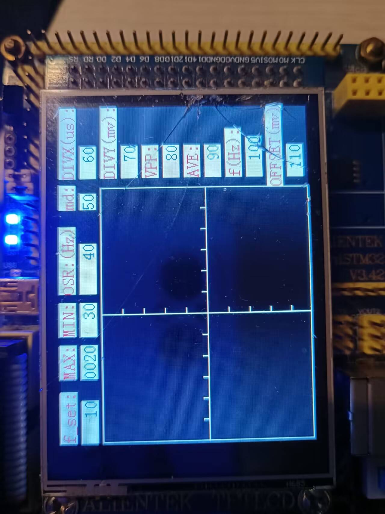

# 快速入门

## LCD简介

LCD就是拿来做显示的，然后他的使用一般就是按照特定的协议，SPI,IIC,8080等，初始化屏幕，我们使用的时候不细研究内部，只是先将正点原子的屏幕代码移植使用。

## 移植过程

将官方的LCD文件夹复制到自己的HARDWARE文件夹中，什么板子就去什么板子的程序源码里面去复制，因为不同板子用的板子方案不一样。

移植完了后，将lcd.c加入工程中，然后添加他的.h路径，然后编译一下，编译可能会发现报错说没有一些文件，因为串口和延时的头文件，我建立的文件加了bsp_，他的没有加，所以要在他的那几个文件中加上。

修改后编译就能通过了。

## 使用测试

这里测试一个画一个矩形

```C
#include "stm32f10x.h"

#include "bsp_led.h"
#include "bsp_key.h"
#include "bsp_exti.h"
#include "bsp_timer.h"
#include "bsp_usart.h"
#include "bsp_delay.h" 
#include "bsp_sys.h"
 
#include "lcd.h" 
 
int main(void)
{	
	NVIC_PriorityGroupConfig(NVIC_PriorityGroup_2);
	bsp_led_init();
	bsp_key_init();
	bsp_exti_init();
	bsp_timer_init(5000,72);
	bsp_usart1_init(115200);
	delay_init();
	
	LCD_Init();                   //初始化LCD
	POINT_COLOR = RED;            //选择画笔颜色
	LCD_Fill(0, 0, 20, 20, RED);  //从（0，0）到（20，20）覆盖一片红色的矩形
	
	printf("hello world\r\n");
	while(1)
	{
		
	}
}

```

## 界面绘制

先给我们的项目绘制一个静态的界面。

 建立一个APP文件夹，里面放置实际的应用。然后再在工程中也建立一个APP文件夹，建立osc_ui.c和osc_ui.h用来专门保存实际绘制的图形。

先将显示器横屏

```
LCD_Display_Dir(1);  //将显示屏横屏
```

然后做一个规划，我们的屏幕是240x320的，那么我们横屏后就是横着320竖着240，把屏横过来后，以左上角为（0，0）点，横着往右x依次增，竖着往下y依次增。但是我做这个的时候，在画线的时候希望像正常的以左下角为（0，0）点，所以将画线函数重写了一下，但也只是画线重写了。其他显示文字啥的还是按照原来的坐标。

```
/*
划线函数，将Y轴坐标进行翻转变换
*/
void lcd_drawline(u16 x1, u16 y1, u16 x2, u16 y2)
{
	LCD_DrawLine(x1,240-y1,x2,240-y2);
}
```

下面就是显示，显示分为一个初始化，一个循环中执行的。

初始化中，初始化LCD，显示器横屏，然后把全屏变黑，为什么变黑，感觉黑背景好看点。

```c
void osc_ui_init()
{
	LCD_Init();
	POINT_COLOR = RED;
	LCD_Display_Dir(1);  //将显示屏横屏
	LCD_Clear(BLACK);
	
}
```

下面是重复执行的函数

```c
void osc_ui_loop()
{
	
}
```

然后在main函数中调用

```c
#include "stm32f10x.h"

#include "bsp_led.h"
#include "bsp_key.h"
#include "bsp_exti.h"
#include "bsp_timer.h"
#include "bsp_usart.h"
#include "bsp_delay.h" 
#include "bsp_sys.h"
 
#include "lcd.h" 
#include "osc_ui.h" 

int main(void)
{	
	NVIC_PriorityGroupConfig(NVIC_PriorityGroup_2);
	bsp_led_init();
	bsp_key_init();
	bsp_exti_init();
	bsp_timer_init(5000,72);
	bsp_usart1_init(115200);
	delay_init();
	
	osc_ui_init();
	
	printf("hello world\r\n");
	while(1)
	{
		osc_ui_loop();
	}
}
```

然后绘制基本界面，先绘制一个参数名字的部分，这个函数很简单，就是在各个位置去画一串字符。

```
/*
显示示波器界面所需的参数名称
*/
void show_jiemian()
{
	LCD_ShowString(0,0,100,16,16,     "f_set:");		
	LCD_ShowString(60,0,100,16,16,    "MAX:");		
	LCD_ShowString(100,0,100,16,16,   "MIN:");
	LCD_ShowString(140,0,100,16,16,   "OSR:(Hz)");
	LCD_ShowString(220,0,100,16,16,   "md:");
	
	LCD_ShowString(250,0,80,16,16,    "DIVX(us):");
	LCD_ShowString(250,40,80,16,16,   "DIVY(mv):");
	LCD_ShowString(250,80,80,16,16,   "VPP:");
	LCD_ShowString(250,120,80,16,16,  "AVE:");
	LCD_ShowString(250,160,80,16,16,  "f(Hz):");
	LCD_ShowString(241,200,80,16,16,  "OFFSET(mv):");			
}
```

然后绘制基本的框架，和各个部分的数字，显示具体的参数我们先使用一些固定的数字代替

```c
/*
画示波器的框框，和分度线，以及显示各个参数的数值
*/
void show_ui()
{
	int16_t i;
	
	POINT_COLOR = WHITE;
	//画框框
	lcd_drawline(0,0,  0,200);
	lcd_drawline(0,0,  240,0);
	lcd_drawline(0,200,240,200);
	lcd_drawline(240,0,240,200);
	lcd_drawline(120,0,120,200);
	lcd_drawline(0,100,240,100);
	
	//画分度线
	for(i=0;i<12;i++)
	{
		lcd_drawline(20+i*20,100,20+i*20,105);
	}
	for(i=0;i<10;i++)
	{
		lcd_drawline(120,i*20,125,i*20);
	}
	
	POINT_COLOR = BLUE;
	//显示各个参数数值
	LCD_ShowNum(0,20,   10,    5,16);
	LCD_ShowxNum(60,20, 20,    4,16,0X80);
	LCD_ShowNum(100,20, 30,    4,16);
	LCD_ShowNum(140,20, 40,    6,16);
	LCD_ShowNum(220,20, 50,    2,16);
	LCD_ShowNum(250,20, 60,    4,16);
	LCD_ShowNum(250,60, 70,    4,16);
	LCD_ShowNum(250,100,80,    4,16);
	LCD_ShowNum(250,140,90,    4,16);
	LCD_ShowNum(250,180,100,   5,16);
	LCD_ShowNum(250,220,110,   4,16);
	 
	POINT_COLOR = YELLOW;
	
}
```

然后把osc_ui_init完善一下。

```c
void osc_ui_init()
{
	LCD_Init();
	POINT_COLOR = RED;
	LCD_Display_Dir(1);  //将显示屏横屏
	LCD_Clear(BLACK);
	show_const_arg();
	show_ui();
}
```

下载进去后，就可以看到以下的效果



下面简单显示一个波形，代码如下，其实就是把每一个时候的值连起来。我们的框框画的是一个横着240竖着200的点，相当于横着x有240个点，y有200个点，那我们把每个x点应该的y值算出来，就可以了。

下面是一个240的数组点，但是这个最大值给的是4095，我们把这个数组做一个等价的变换，换到最大值200。

```c
//正弦波数据
int16_t DAC_Value[240] ={
	2048,2176,2304,2431,2557,2680,2801,2919,3034,3144,
	3251,3352,3449,3540,3625,3704,3776,3842,3900,3951,
	3995,4031,4059,4079,4091,4095,4092,4080,4060,4032,
	3996,3952,3901,3843,3778,3706,3627,3542,3451,3355,
	3253,3147,3037,2922,2804,2683,2560,2434,2307,2179,
	2051,1922,1794,1667,1542,1418,1297,1179,1064,953,
	847,745,648,557,472,393,321,255,196,145,
	101,65,37,16,4,0,3,15,35,63,98,
	141,192,250,315,387,466,551,641,738,839,
	945,1056,1170,1288,1409,1532,1658,1784,1912	,
	2048,2176,2304,2431,2557,2680,2801,2919,3034,3144,
	3251,3352,3449,3540,3625,3704,3776,3842,3900,3951,
	3995,4031,4059,4079,4091,4095,4092,4080,4060,4032,
	3996,3952,3901,3843,3778,3706,3627,3542,3451,3355,
	3253,3147,3037,2922,2804,2683,2560,2434,2307,2179,
	2051,1922,1794,1667,1542,1418,1297,1179,1064,953,
	847,745,648,557,472,393,321,255,196,145,
	101,65,37,16,4,0,3,15,35,63,98,
	141,192,250,315,387,466,551,641,738,839,
	945,1056,1170,1288,1409,1532,1658,1784,1912	,
	2048,2176,2304,2431,2557,2680,2801,2919,3034,3144,
	3251,3352,3449,3540,3625,3704,3776,3842,3900,3951,
	3995,4031,4059,4079,4091,4095,4092,4080,4060,4032,
	3996,3952,3901,3843,3778,3706,3627,3542,3451,3355,
};
```

下面是变换方式

```
DAC_Value[0]*200/4096;
```

然后整体的处理就如下

```c
/*
显示波形
*/
void show_wave()
{
	int16_t i;
	for(i=0;i<239;i++)
	{
		lcd_drawline(i,DAC_Value[i]*200/4096,i+1,DAC_Value[i+1]*200/4096);	
	}
}
```

把这个放到osc_ui_init中显示测试

